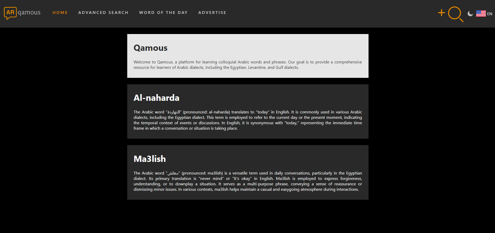

# Qamous Frontend

## Description
The Qamous Frontend is the client-side component of the Qamous application, a platform for users to contribute and explore definitions of Arabic and Franco-Arabic words. The frontend is responsible for providing a user-friendly interface for user authentication, word and definition management, as well as user interactions such as liking, disliking, and reporting definitions.

## Technologies Used
- **React.js**: A JavaScript library for building user interfaces.
- **TypeScript**: A statically typed superset of JavaScript that adds optional types.
- **SCSS (SASS)**: A preprocessor scripting language that is interpreted or compiled into Cascading Style Sheets (CSS).
- **Axios**: A promise-based HTTP client for the browser and Node.js.

## Setup Instructions
1. Clone the repository: `git clone <repository-url>`
2. Navigate to the project directory: `cd urban-dictionary-ar-frontend`
3. Install dependencies: `npm install`
4. Configure environment variables:
    - Create a `.env` file in the root directory.
    - Define the following environment variables:
      ```
      REACT_APP_API_URL=<your-backend-api-url>
      ```
5. Start the server: `npm start`

## Features
- User Registration and Login
- Word and Definition Management
- User Interactions (Liking, Disliking, Reporting Definitions)
- User Profile Management

## Contributors
- [Anthony Elkommos Youssef](https://github.com/anthonyyoussef01)

## License
This project is licensed under the Mozilla Public License Version 2.0 - see the [LICENSE](LICENSE) file for details.

## Images

