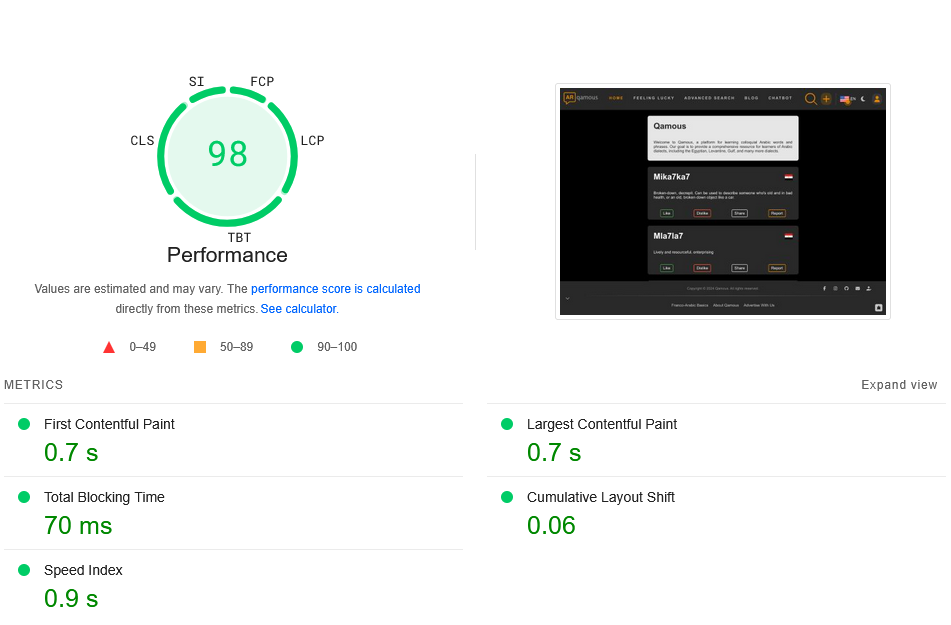
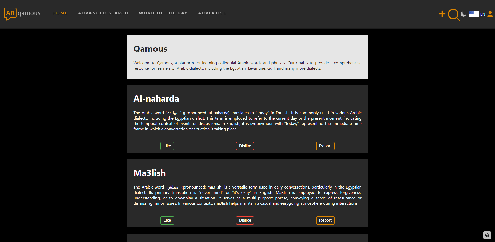
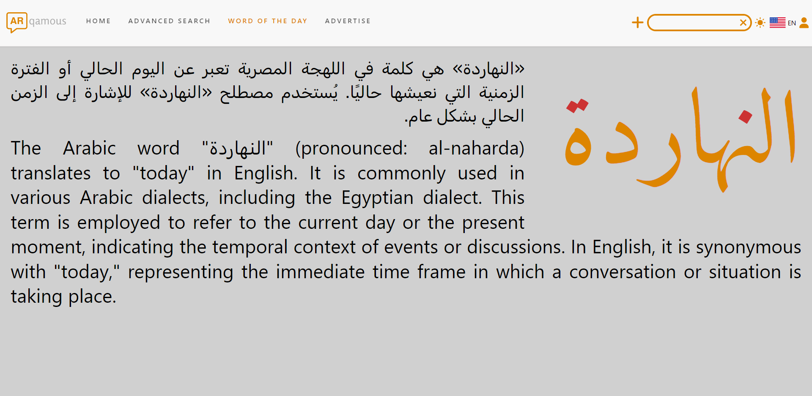
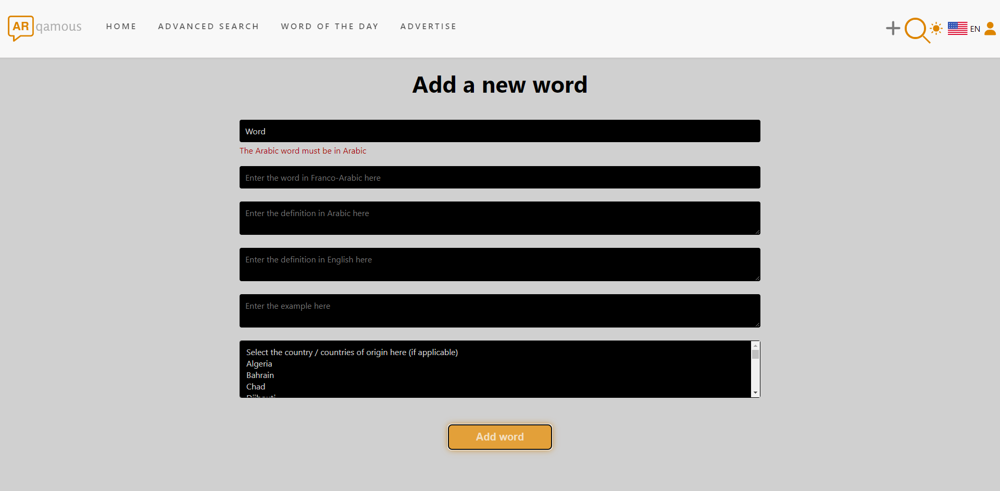
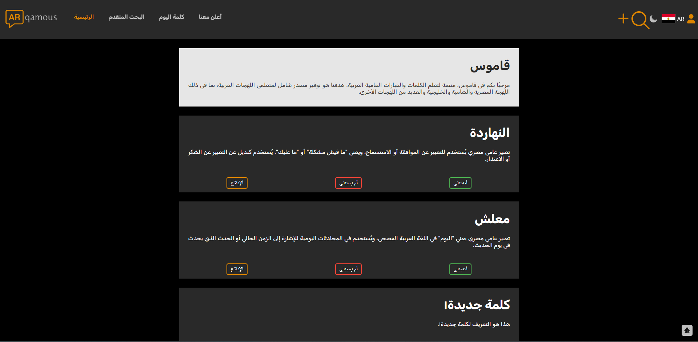
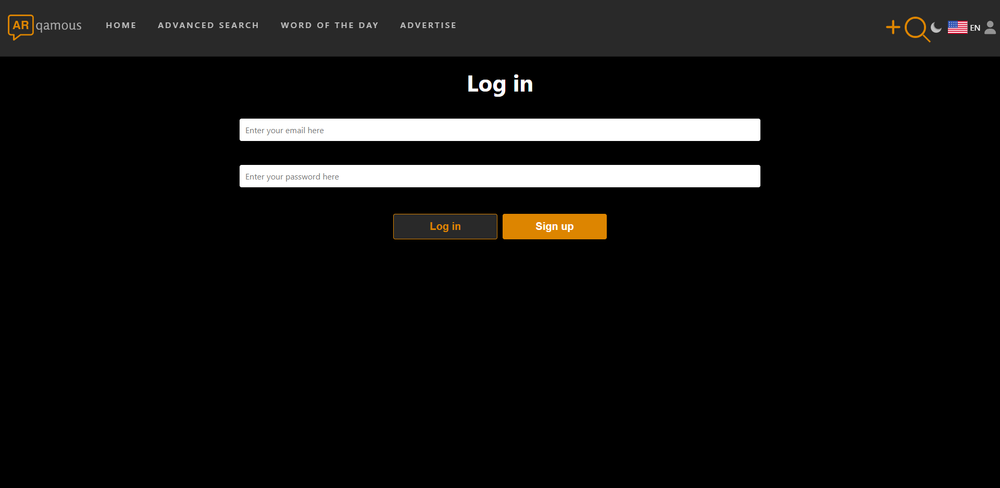
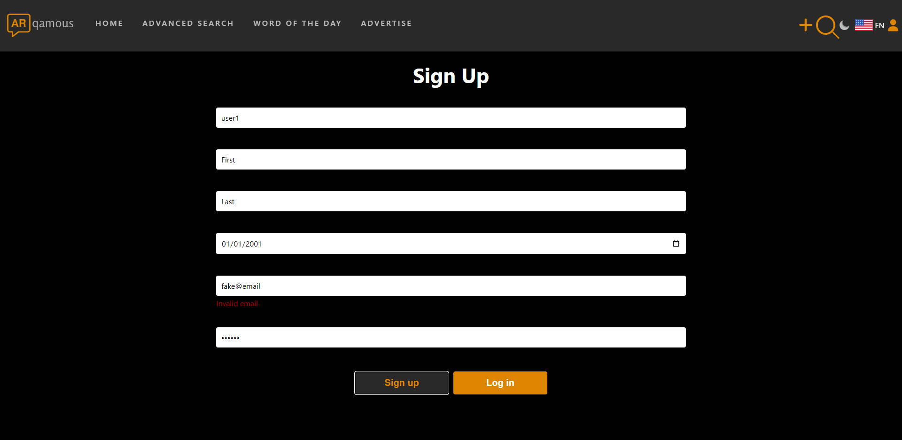
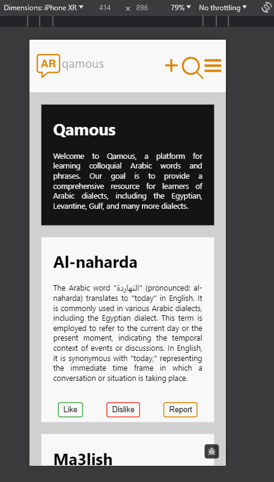
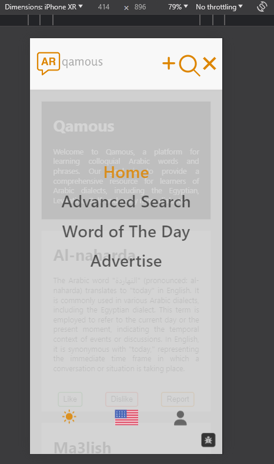
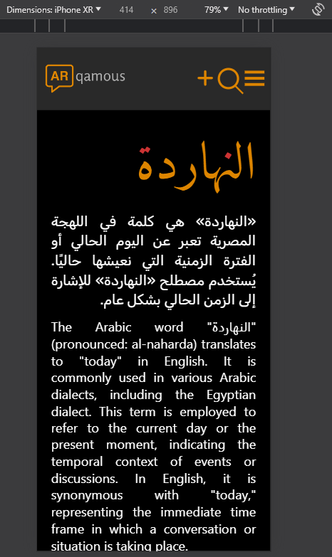

# Qamous Frontend

## Description
Qamous (قاموس) is a comprehensive platform for exploring and contributing to Arabic and Franco-Arabic word definitions. The frontend provides an intuitive interface for users to discover, learn, and share colloquial Arabic words across various dialects including Egyptian, Levantine, Gulf, and more. With support for both English and Arabic interfaces, Qamous makes Arabic language learning accessible to a global audience.

**Looking for the Back-End? Find it [here](https://github.com/anthonyyoussef01/Qamous-Backend).**



## Key Features
- **Multilingual Support**: Full support for English and Arabic interfaces with RTL/LTR handling
- **User Authentication**: Secure registration and login system with password recovery
- **Word Management**:
  - Add new words with definitions in both Arabic and Franco-Arabic
  - Provide usage examples and dialect information
  - Country-specific word categorization
- **Interactive Features**:
  - Like/Dislike definitions
  - Report inappropriate content
  - Share words on social media
- **Advanced Search**: Search words by dialect, country, or text
- **Word of the Day**: Daily featured words to enhance learning
- **User Profiles**: Track contributions and manage account settings
- **Blog System**: Community posts about Arabic language and culture
- **Responsive Design**: Optimized for both desktop and mobile devices
- **Chatbot Integration**: AI-powered assistance for users

## Technologies Used
- **React.js**: Frontend framework with TypeScript for type safety
- **Vite**: Next-generation frontend tooling
- **SCSS/SASS**: Advanced styling with CSS preprocessing
- **React Query**: Efficient server state management and caching
- **i18next**: Comprehensive internationalization framework
- **Firebase**: Blog post storage and management
- **Vercel Analytics**: Performance monitoring and analytics
- **Font Awesome**: Icon library for enhanced UI

## Setup Instructions
1. Clone the repository:
   ```bash
   git clone <repository-url>
   ```
2. Navigate to the project directory:
   ```bash
   cd qamous
   ```
3. Install dependencies:
   ```bash
   npm install
   ```
4. Configure environment variables:
   - Create a `.env` file in the root directory
   - Add the following variables:
     ```env
     VITE_API_URL=<your-backend-api-url>
     ```
5. Start the development server:
   ```bash
   npm start
   ```

## Development Scripts
- `npm start`: Launch development server
- `npm run build`: Build for production
- `npm test`: Run test suite
- `npm run serve`: Preview production build

## Contributing
Contributions are welcome! Please feel free to submit a Pull Request. For major changes, please open an issue first to discuss what you would like to change.

## Contributors
- [Anthony Elkommos Youssef](https://github.com/anthonyyoussef01)

## License
This project is licensed under the Mozilla Public License Version 2.0 - see the [LICENSE](LICENSE) file for details.

## Project Screenshots

### Desktop Views

*Dark mode home page with search functionality*


*Word of the Day feature in light mode*


*Add new word interface with validation*


*Arabic interface support with RTL layout*


*User authentication interface*


*New user registration form*

### Mobile Views

*Responsive mobile home interface*


*Mobile navigation menu*


*Mobile-optimized Word of the Day feature*
